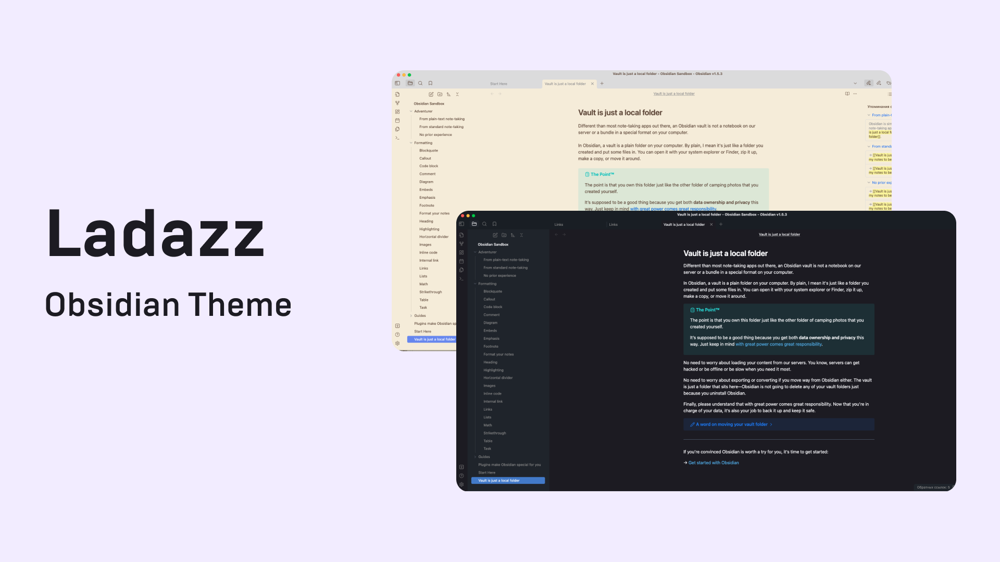

Ladazz is an [Obsidian](https://obsidian.md/) theme for desktop, mobile and tablet.

## Installation

To install the theme

1. Download theme.css and manifest.json files from latest release 
2. Go to /your_vault/.obsidian/themes/ and create folder ladazz for theme files
3. Paste downloaded theme files into created folder 
4. In Obsidian go to Settings -> Appearance -> select Ladazz Theme in dropdown menu

